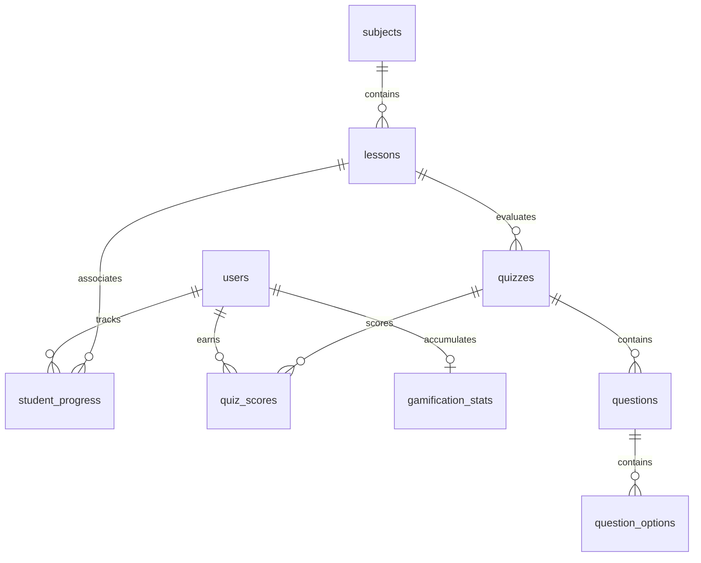

# State of Code - Interactive E-Learning System

This document serves as the master technical reference and architectural blueprint for the **Interactive E-Learning System for Primary School Students**.

---

## 1. Project Overview & Constraints

* **Project Name:** Interactive E-Learning System for Primary School Students
* **Target Audience:**
  * **Students:** Ages 7-12. Mobile-first viewport (`max-width: 480px`), highly visual, bubbly primary-colored theme, rounded touch targets, minimal text, and high gamification feedback.
  * **Teachers & Admins:** Desktop-first (1440px width), professional layout, data-dense metrics dashboards, tables, and content creation forms.
* **Tech Stack:**
  * **Front-end:** HTML5, CSS3 (using custom CSS variables for design consistency), Vanilla JavaScript.
  * **Back-end:** PHP (PDO API wrapper) and MySQL Database.
  * **Dependencies:** Strict **No External Libraries or Frameworks** rule. All interactive features (sound effects, drag-and-drop systems, dynamic builders) are written in pure Vanilla HTML/CSS/JS.
* **System Constraints:** Zero runtime errors, input filtering/escaping for DB inserts, role-based authorization, and offline local-execution compatibility.

---

## 2. Master Database Schema

The database relies on a relational MySQL structure with cascade deletes to maintain relational integrity.



### Table Specifications

#### 1. `users`
Holds accounts for students, teachers, and system administrators.
* `user_id` (INT, PK, AUTO_INCREMENT)
* `username` (VARCHAR(100), UNIQUE) - Student username (e.g. 'timmy') or staff email.
* `password_hash` (VARCHAR(255)) - Bcrypt hash of student 4-digit PIN or staff password.
* `role` (ENUM('student', 'teacher', 'admin')) - Permission access tier.
* `full_name` (VARCHAR(100)) - Screen display name.
* `class_section` (VARCHAR(50), NULL) - Target school cohort.
* `avatar_url` (VARCHAR(255), NULL) - Character avatar name (e.g. 'monkey', 'bunny').
* `created_at` (TIMESTAMP)
* > [!NOTE]
  > Teachers do not have permission to register new student accounts; this transaction is strictly restricted to the System Administrator (`admin/manage_users.php`) to ensure proper class assignment and security auditing.

#### 2. `subjects`
Topic areas created by admins.
* `subject_id` (INT, PK, AUTO_INCREMENT)
* `subject_name` (VARCHAR(100), UNIQUE)
* `teacher_id` (INT, FK, NULL) - Links to `users.user_id` (ON DELETE SET NULL).
* `icon_url` (VARCHAR(255), NULL)

#### 3. `lessons`
Worksheet and video files associated with a parent subject.
* `lesson_id` (INT, PK, AUTO_INCREMENT)
* `subject_id` (INT, FK) - Links to `subjects.subject_id` (ON DELETE CASCADE).
* `title` (VARCHAR(150))
* `video_url` (VARCHAR(255), NULL) - Local server path to MP4 asset (e.g., `assets/videos/sample.mp4`), preventing reliance on third-party streams.
* `worksheet_url` (VARCHAR(255), NULL) - Local path to downloadable PDF.
* `teacher_notes` (TEXT, NULL) - Direct notes, homework instructions, or context written by teachers for the student view.
* `order_num` (INT, DEFAULT 1) - Grid ordering sequence.
* `created_at` (TIMESTAMP)

#### 4. `student_progress`
Logs student curriculum completion statuses.
* `progress_id` (INT, PK, AUTO_INCREMENT)
* `student_id` (INT, FK) - Links to `users.user_id` (ON DELETE CASCADE).
* `lesson_id` (INT, FK) - Links to `lessons.lesson_id` (ON DELETE CASCADE).
* `status` (ENUM('not_started', 'in_progress', 'completed'), DEFAULT 'not_started')
* `last_accessed` (DATETIME)

#### 5. `quizzes`
Evaluation configurations.
* `quiz_id` (INT, PK, AUTO_INCREMENT)
* `lesson_id` (INT, NULL, FK) - Links to `lessons.lesson_id` (ON DELETE CASCADE). Changed to nullable to support 1-to-many relationship mapping and standalone classroom quizzes.
* `class_section` (VARCHAR(50), NULL) - Associated cohort, added for standalone class assessments.
* `quiz_title` (VARCHAR(150), DEFAULT 'Knowledge Check') - Custom user-facing title.
* `total_marks` (INT, DEFAULT 10)
* `questions_json` (TEXT) - Fallback serialized JSON representation of questions for student app compatibility.

#### 6. `questions`
Relational database storage of quiz questions.
* `question_id` (INT, PK, AUTO_INCREMENT)
* `quiz_id` (INT, FK) - Links to `quizzes.quiz_id` (ON DELETE CASCADE).
* `question_text` (TEXT)
* `question_type` (ENUM('single_choice', 'multiple_choice', 'fill_in_the_blank', 'drag_and_put', 'connecting_the_link'))
* `order_num` (INT, DEFAULT 1)

#### 7. `question_options`
Relational database storage of options, correct answers, and categories.
* `option_id` (INT, PK, AUTO_INCREMENT)
* `question_id` (INT, FK) - Links to `questions.question_id` (ON DELETE CASCADE).
* `option_text` (TEXT)
* `is_correct` (TINYINT, DEFAULT 0) - Used for choices, correct blanks, or matching left elements.
* `matching_pair` (TEXT, NULL) - Links matched right elements.
* `category` (VARCHAR(100), NULL) - Holds categorization buckets to support 1-to-Many Drag & Put touch interfaces.

#### 8. `quiz_scores`
Records marks earned by students.
* `score_id` (INT, PK, AUTO_INCREMENT)
* `student_id` (INT, FK) - Links to `users.user_id` (ON DELETE CASCADE).
* `quiz_id` (INT, FK) - Links to `quizzes.quiz_id` (ON DELETE CASCADE).
* `marks_earned` (INT)
* `completed_at` (TIMESTAMP)

#### 9. `gamification_stats`
Tracks active points totals and streak calculations.
* `stat_id` (INT, PK, AUTO_INCREMENT)
* `student_id` (INT, UNIQUE, FK) - Links to `users.user_id` (ON DELETE CASCADE).
* `total_points` (INT, DEFAULT 0)
* `login_streak` (INT, DEFAULT 0)
* `last_login` (DATE, NULL)

---

## 3. Directory & File Structure

```
e-learning system/
├── admin/
│   ├── dashboard.php            # Main administrative panel (with storage calculations)
│   ├── manage_curriculum.php    # Topic editor & subject manager
│   ├── manage_users.php         # Admin-only user creation and roster database panel
│   └── system_reports.php       # SQL logs and diagnostics
├── admin_login.php              # Secure login portal for admins
├── assets/
│   ├── css/
│   │   ├── admin.css            # Stylesheets for administrator layout
│   │   ├── dashboard.css        # Stylesheets for teacher portal layout
│   │   └── student.css          # Stylesheets for student mobile wrap layout
│   └── js/
│       ├── audio.js             # Web Audio API Synthesizer (correct/error sounds)
│       ├── quiz_engine.js       # Core student quiz player logic engine (5 types)
│       └── student.js           # Student app interactions, pinpads, and video players
├── auth/
│   └── logout.php               # Destroys session
├── config/
│   └── db.php                   # PDO Database wrapper configuration
├── database.sql                 # Unified schema dump and complete seeding configurations
├── implementation_plan.md       # High-level architecture roadmap
├── import_db.php                # Database importer utility
├── includes/
│   └── auth.php                 # Authentication helper checks
├── index.php                    # System landing page
├── login.php                    # Mobile avatar PIN keypad login page (paginated)
├── student/
│   ├── class_leaderboard.php    # Gamified class leaderboard ranks
│   ├── course.php               # Course lesson timeline path
│   ├── dashboard.php            # Student dashboard, streaks, and subject cards
│   ├── lesson.php               # Active Lesson page with player and quizzes
│   ├── save_score.php           # Score saving API endpoint
│   ├── student_quiz.php         # Mobile-first interactive quiz player wrapper
│   ├── subjects.php             # Subject catalog with progress percentage bars
│   └── update_progress.php      # Progress tracking API endpoint
├── teacher/
│   ├── curriculum.php           # Curriculum, lessons list, and PDF uploads
│   ├── dashboard.php            # Teacher overview metrics
│   ├── quizzes.php              # Advanced Quiz Builder interface
│   ├── review.php               # Roster reviews, grading, and manual XP award workflow
│   └── roster.php               # Class rosters (with dynamic leaderboard tables)
└── teacher_login.php            # Secure login portal for teachers
```

---

## 4. Current Implementation Status

### Front-End Interfaces
* **Student Mobile UI:** Playful bubble layout constrained to `max-width: 480px`. Contains a **4x2 paginated avatar selector** (8 cards per page with `<` and `>` controls toggled using CSS visibility variables) on the login page to optimize layout space.
* **Teacher Web Dashboard:** Features curriculum management, lesson notes review, and student assessment metrics. Integrates a **dynamic Class Leaderboard** directly inside the roster list and handles manual grading adjustments via a contextual **"Grade & Award XP" subpage workflow** in `teacher/review.php`.
* **Admin Web Dashboard:** Administrative hub presenting database statistics, usage grids, and a storage calculation widget display.

### Vanilla JS Logic
* **Web Audio Sound Synthesizer:** Real-time generation of gamification alerts (success chimes and error buzzers) using pure browser `AudioContext` nodes. No external audio files are downloaded or cached.
* **Client-side Avatar Pagination:** Standardizes navigation on the PIN entry screen, dynamically hiding/revealing button elements using `.style.visibility = 'hidden' | 'visible'` to avoid layout reflow shifts.
* **Interactive Quiz Player Engine (`quiz_engine.js`):** Supports 5 custom question types, including complex **1-to-Many drop zone arrays** for classification sorting (Drag & Put) and interactive line-drawing matching (Connecting the Link).

### PHP/MySQL Back-End Integration
* **File Upload & Clean Up:** Processes worksheets and video files using standard secure multipart handlers (`move_uploaded_file`). Features an automated **garbage collector system calling `unlink()`** when a lesson or subject is deleted, cleaning up orphaned PDFs and MP4s from the assets folder.
* **Admin Storage Metrics Helper:** Implements a recursive directory calculator (`getFolderSize`) checking the `/assets/` workspace directory size in bytes, calculating real-time usage percentages relative to the **500MB server limit**.

---

## 5. Next Immediate Action Items

1. **Final UI/UX cross-browser testing:** Verify touch interaction behavior on iOS and Android viewports.
2. **Import `seed_data.sql` for presentation:** Setup the staging server with populated classrooms.
3. **Package system for final academic submission:** Create zip files and archive directories.
